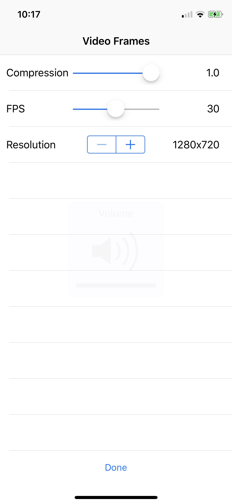

# MobiDev

This project contains an iOS app that gathers sensors data from the phone and a python library that creates a server that logs 
the receiving data

## Prerequisites

* iOS version > 11.3 
* Python 2.7 on the server
* MongoDB on the server

All python dependencies are downloadable with pip:
* pip install python-socketio
* pip install eventlet
* pip install pymongo
* pip install protobuf-to-dict

## Client

Once the app starts, the first view that loads is a list of all the settable parameters. Click on the cell to edit (if editable) and on the switch to toggle the data gather.

### Server
Server address and port

### Session (optional)
Session name (see later for explanation) 

### Accelerometer/Gyroscope/Magnetometer/Compass 
Update interval: how frequently the sensor is going to send the data (in seconds). Smallest value is 0.1s

### Video Frames
* Compression: compression rate of the image that is taken from the camera, it ranges from 0 (lowest image quality, highest compression) to 1 (highest image quality, lowest compression). 
* FPS: how many frames are taken per seconds. Lowest: 1, Highest: 60
* Resolution: list of all possible frames resolution, incrementing the stepper will select a larger resolution 

### ARkit 6d poses/ Planes / Points cloud 
Don't have parameters, moreover planes and points cloud depend directly from the video frames ( activacting these will also activate video frames ) 

  

  

## Server

The library is inside the socketioserver.py file, to start the server just import the library and use the method startServer with the server port as parameter. An example is in the startserver.py file

## About the data

All the data is saved from the server in a MongoDB database. The name of the database is 'MDsensorsDB' and the collection is 'probes'. Every probe has this structure:
* ObjectID
* Date when the probe was received
* Session name, the one chosen from the app
* Uuid of the device that sent the probe
* Probe

Structure of the probe:
* timestamp: when it was gathered from the device
* data: data of the sensor. It can be of different kinds depending from the sensor that gathered the data. 

Important: Arkit poses/Points Cloud/Tracking state if chosen are embedded inside the JpegImage data type

All the sensors data gathered from the device is taken using Apple libraries and not edited, with the exception of video frames that are converted in jpeg.
CoreMotion is used for the accelerometer, gyroscope, magnetometer and CoreLocation for the compass.
Video Frames, arkit poses, planes and points clouds are taken with the arkit library

